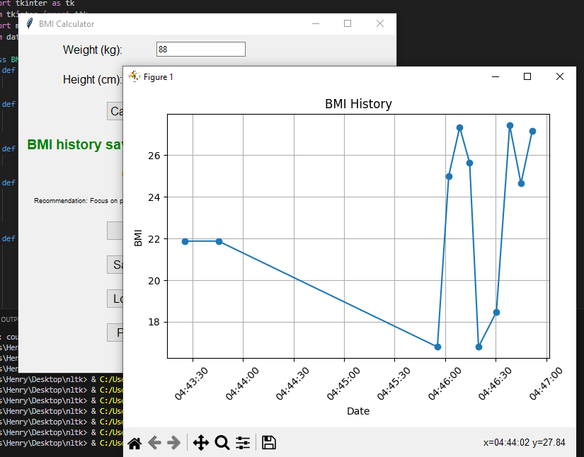
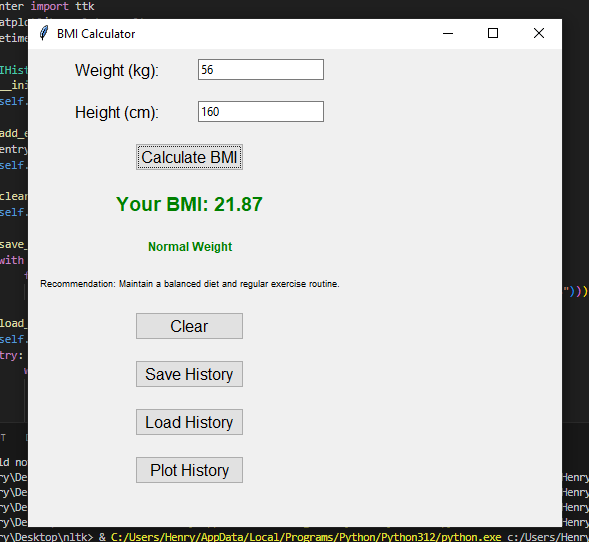

# BMI-Calculator
This is a simple BMI (Body Mass Index) calculator implemented in Python with a graphical user interface using Tkinter.

## Features
- Calculate BMI based on weight (in kilograms) and height (in centimeters).
- Display BMI category (Underweight, Normal Weight, Overweight, Obese) and personalized recommendations.
- Save and load BMI history.
- Plot BMI history over time.

## Requirements
- Python 3.12
- Tkinter (usually comes pre-installed with Python)
  ```bash
  pip install tkinter
- Matplotlib (for plotting BMI history)
  ```bash
  pip install matplotlib

## Usage
1. Clone the repository:
   ```bash
   git clone https://github.com/H3nryK/BMI-Calculator.git
2. Navigate to the project directory:
   ```bash
   cd BMI-Calculator
3. Run the application:
   ```bash
   py bmi.py
4. Enter your weight and height, then click "Calculate BMI" to see the results.

## Screenshots

### BMI History Graph
This screenshot displays the BMI history graph, plotting BMI values over time. Users can visualize their BMI trends and track their progress.



### Calculator Interface
This screenshot shows the main interface of the BMI calculator application. Users can input their weight and height to calculate their BMI.




